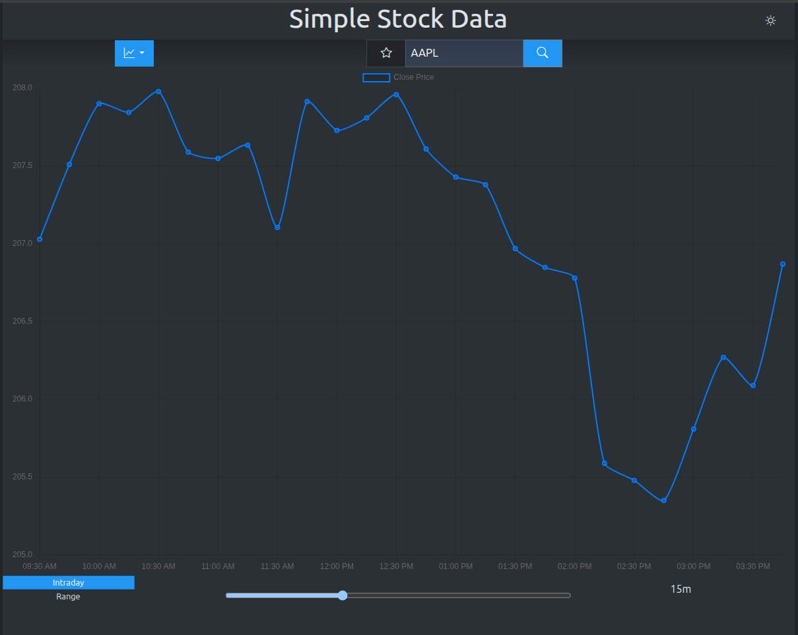

# Simple Stock Data

Deze web applicatie is gemaakt om stockprijzen van bepaalde tickers weer te geven in een visueel aantrekkelijk en gebruiksvriendelijke manier.

De gebruiker kan in de zoekbalk de gewenste ticker ingeven en zoeken. Als deze gevonden wordt door de API, zal die weergegeven worden in de grafiek. De output van deze zoekactie kan in de grafiek op twee manieren worden getoond. Via een dropdownmenu kan er gekozen worden tussen een lijngrafiek of een staafdiagram.

Deze tickers kunnen gefilterd worden op dagelijkse prijsschommelingen of prijsschommelingen over een langere periode, met behulp van radiobuttons. Via een slider kan de gebruiker binnen elke periode de tijdsrelutie aanpassen.

Om de aangename gebruikerservaring te bevorderen kunnen favoriete tickers worden opgeslagen. Deze worden onderaan weergegeven zodat de gebruiker vlot kan schakelen tussen verschillende tickers.

De gegevens uit de grafiek worden ook weergegeven in een tabel. De gebruiker heeft op deze manier meer inzicht op wat zich afspeelt per datapunt of staaf in de grafiek. In deze table kan worden gesorteerd op datum en op volume.

## Features

- Zoeken op aandelen-ticker
- Toevoegen/verwijderen van favorieten (localStorage)
- Keuze tussen lijngrafiek of staafgrafiek
- Themaswitcher
- Interval- en range-slider voor intraday & historische data

## gebruikte API

- [Yahoo Finance via yfinance](https://pypi.org/project/yfinance/)

## Screenshots

zie:

- Zie screenshots in [`docs/screenshots/`](docs/screenshots/)
- 

# Technische vereisten

## 1. DOM manipulatie:

### Elementen selecteren

Zie: `src/main.js`, lijn 36–55

- `document.getElementById(...)`, `querySelector(...)`

### a. Elementen manipuleren

Zie:

- `src/utils/transformChartData.js`
- `src/utils/renderLineChart.js`
- `src/utils/renderBarChart.js`
- Bijvoorbeeld: dynamisch toevoegen van grafieken, aanpassen van tabellen

### b. Events koppelen aan elementen

Bijvoorbeeld:

- `themeToggle.js` voor dark/light theme toggle
- `favorites.js` voor click-events op de favorites-knop
- `sliderControls.js` voor input-events op sliders
- `chartTypeToggle.js` voor dropdown-selectie

---

## 2. Modern JavaScript

### a. Gebruik van constanten

Zie: `src/main.js`, lijn 36–55

- `const chartIcon = document.getElementById("chartIcon");`
- `...`

### b. Template literates

Zie: doorheen het volledige project.

- Bijvoorbeeld: `src/utils/populateStockTable.js`, lijn 13-18

### c. Iteratie over Arrays

forEach methode wordt gebruikt om dynamisch DOM-elementen te generen op basis van de inhoud van de favorites array.
forEach methode wordt gebruikt om te itereren en functionaliteiten te koppelen aan de aanwezige items in de chartTypeToggle dropdown menu.

Zie:

-`src/ui/favorites.js`, lijn 71

-`src/ui/chartTypeToggle.js`, lijn 6

### d. Array methodes

zie:  
-`src/ui/favorites.js`, lijn 5, function updateFavoriteButtonState

-`src/ui/favorites.js`, lijn 19, function toggleFavorites

-`src/ui/favorites.js`, lijn 43, function removeFromFavorites

-`src/utils/sortTableByDate.js`, lijn 8, 24, function sortTableByVolume & sortTableByDate

### e. Arrow Functions

Gebruikt doorheen het hele project.

### f. Conditional (ternary) operator:

Zie:

- src/ui/themeToggle.js lijn 10 & 11, 21 & 22

### g. Callback functions

In het project worden callback functies gebruikt voor het uitvoeren van logica na bepaalde events.
Bijvoorbeeld bij het toevoegen/verwijderen van favorieten en het ophalen van gegevens bij het klikken op een opgeslagen ticker.

- `src/main/main.js`, lijn 91, lijn 99
- `src/ui/favorites.js`, lijn 19, lijn 71

### h. Promises

- zie fetch() in `src/init/intraDay.js` en `src/init/dateRangeData.js`

### i. Async & Await

- `src/init/intraDay.js`

- `src/init/dateRangeData.js`

### j. Observer API

Er wordt gebruikt gemaakt van een Observer-API op de tabel.

zie:

- `src/ui/sliderControls.js`, lijn 110

## 3. Data & API

### a. Fetch

Wordt gebruikt om asynchroon data op te halen van een externe API.

zie:

- `src/init/intradayData.js`

- `src/init/dateRangeData.js`

### b. JSON maniupleren en weergeven

JSON-data die wordt opgehaald door Fetch() wordt omgezet via een functie transformToChart() om deze bruikbaar te maken voor de grafiek en tabellen.

- `src/utils/transformChartData.js`
- `src/utils/populateStockTable.js`

## 4. Opslag & validatie

### a. Formulier validatie

Er is momenteel geen klassieke formulier validatie. Wel wordt er user input gevalideerd in functie van de API-oproepen.

- `src/utils/validateParams.js`

### b. Gebruik van LocalStorage

LocalStorage wordt gebruikt om favorites lokaal op te slaan:

- `src/ui/favorites.js`

## 5. Styling & layout

- [x] Basis HTML & CSS layout
- [x] Gebruiksvriendelijke elementen

## 6. Tooling & structuur

Project is opgezet met Vite en er werd aandacht besteed
aan de folderstructuur om alles zo modulair en onderhoudsvriendelijk mogelijk te houden.

# Deployment

## Setup

```bash
git clone https://github.com/TomIgnoul/SimpleStockData.git
cd SimpleStockData
```

## Start de backend

**🐧 Linux / 🍎 macOS**

```
chmod +x setup_backend.sh
./setup_backend.sh
```

**🪟 Windows (cmd of Powershell)**

```
setup_backend.bat
```

## Start de frontend

Open een tweede terminal en voer uit:

```
npm install
npm run dev
```

De frontend draait op:

- http://localhost:5173

## Vereisten

### Python

- **linux**

```
sudo apt install python3 python3-pip -y
```

- **macOS**

```
brew install python
```

Als brew nog niet geinstalleerd is op je machine voer dan het volgende uit:

```
/bin/bash -c "$(curl -fsSL https://raw.githubusercontent.com/Homebrew/install/HEAD/install.sh)"
```

- **Windows**

Download en installeer via: https://www.python.org/downloads/windows/

### Node.js + npm

- **linux**

```
sudo apt install nodejs npm
```

- **macOS**

```
brew install node
```

- **Windows**
  Download en installeer via: https://nodejs.org/

# Bijdragen

Met dank aan [Jordy Schuermans](https://github.com/JordySchuermans) voor hulp bij het opzetten van de API en fetch-data features.

# Bronnen

- [Flask](https://flask.palletsprojects.com/)
- [yfinance op PyPI](https://pypi.org/project/yfinance/)
- [Vite](https://vitejs.dev/)
- [Chart.js voor de grafiek](https://www.chartjs.org/docs/latest/)
- [Bootstrap](https://getbootstrap.com/)
- [Mdn voor algemene concepten](https://developer.mozilla.org/en-US/)
- [FreeCodeCamp voor Debounce function](https://www.freecodecamp.org/news/javascript-debounce-example/)
- [geeksforgeeks: table sorting](https://www.geeksforgeeks.org/how-to-sort-rows-in-a-table-using-javascript/)
- [Reactive chart canvas](https://codepen.io/chartjs/pen/YVWZbz)
- [Readme inspiration](https://www.freecodecamp.org/news/how-to-write-a-good-readme-file/)
- [Readme execution](https://readme.so)
- ChatGPT - overal coding companion ([GPT Chatlog PDF](docs/GPT_Chatlog.pdf))
